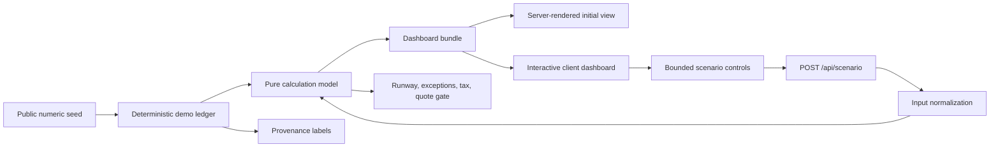

# Weekmark Household Lab

Weekmark is a clean-room public portfolio project for weekly household financial planning. It is designed to answer four practical questions without centering the experience on debt payoff:

1. What is safe to spend before the next decision window?
2. Where does operating cash become tight over the next 13 weeks?
3. Is variable income being separated from its tax reserve?
4. Does a financing choice pass both cash-flow and quote-quality guardrails?

The application demonstrates an interactive React dashboard, a server-rendered initial state, a validated scenario API, deterministic synthetic data, responsive information design, accessible alternatives to charts, model documentation, and privacy-by-construction.

**Live demo:** [weekmark-household-lab.charlielucas95.chatgpt.site](https://weekmark-household-lab.charlielucas95.chatgpt.site)

> No live financial data is used. Every amount, label, obligation, event, and trend is fictional and reproducible from the public seed in `lib/seed.ts`.

## Quick start (under five minutes)

Requirements: Node.js 22.13 or newer.

```bash
npm install
npm run dev
```

Open the local URL printed by the development server. Then:

- choose a conservative, baseline, or growth preset;
- adjust the reliable-income, variable-income, reserve, weekly-cap, fixed-cost, or cash-floor controls;
- select **Run scenario** to recalculate through the local API;
- inspect a runway week, filter and acknowledge exceptions, edit the generalized financing quote, and compare monthly trends.

Validation commands:

```bash
npm run lint
npm run typecheck
npm test
npm run build
```

## Feature tour

- **Weekly cockpit:** a safe flexible-spending cap, cash-floor guardrail, 14-day commitments, fixed-cost load, and an inspectable 13-week runway.
- **Exception inbox:** prioritized cash, tax, behavior, event, and financing signals with session-only acknowledgements.
- **Income and tax waterfall:** reliable net income stays separate from variable gross, modeled reserve, usable variable income, obligations, flexible spending, financing, and margin.
- **Fixed-cost calendar:** recurring obligations appear in due-day order with essential/reviewable status and visible confidence.
- **Financing quality gate:** a generalized household decision checks fixed versus variable rate, prepayment penalty, fee level, payment room, and 13-week cash-floor preservation.
- **Trends and net position:** twelve seeded months compare inflow with spending and reconstruct assets minus liabilities.
- **Provenance and confidence:** every source is labeled as seeded evidence, current-session input, or modeled output.
- **Responsive and accessible interaction:** 44-pixel controls, keyboard focus, chart tables, reduced-motion support, horizontal-scroll affordances, and print cleanup.

## Architecture and data flow



The initial page is computed on the server. Interactive scenario changes are sent to a local route, normalized, recalculated by the same pure model, and returned with `Cache-Control: no-store`. The browser keeps only transient UI state such as the active chart point and acknowledged signals.

See [Architecture](docs/ARCHITECTURE.md) for module boundaries and design decisions.

## Deterministic synthetic dataset and privacy boundary

`createDemoLedger()` uses a fixed integer seed and a small deterministic pseudo-random generator. It does not read the current time, environment variables, browser storage, files, network services, or external accounts. Repeated calls produce byte-equivalent data.

The domain model intentionally has no fields for:

- merchants or payees;
- transaction rows, memos, or imported statements;
- account or routing numbers;
- access tokens, credentials, or login state;
- real household names, employers, addresses, or financial institutions.

Tests scan both generated output and source content for restricted key names and known private identifiers. See the [Privacy threat model](docs/PRIVACY_THREAT_MODEL.md).

## Key model formulas

The full definitions and limitations are in [Metrics and formulas](docs/METRICS.md).

### Spendable and protected cash

```text
spendable cash = operating cash
protected cash = tax reserve + health reserve
```

Protected cash is displayed but excluded from the 13-week operating runway.

### Variable-income waterfall

```text
variable tax set-aside = variable gross × selected reserve rate
variable usable = variable gross − variable tax set-aside
usable monthly income = reliable net + variable usable
```

### Thirteen-week runway

```text
ending cash[w] = ending cash[w−1]
               + modeled income[w]
               − calendar obligations[w]
               − weekly flexible cap
               − known one-off events[w]
               − weeklyized financing payment
```

### Financing quote

```text
financed amount = requested proceeds ÷ (1 − origination fee rate)
monthly payment = standard fixed-rate amortization payment
financing cost = monthly payment × term − requested proceeds
```

The gate is a transparent product heuristic, not underwriting or financial advice.

## Tests and accessibility

The test suite covers:

- deterministic seed reproduction;
- input bounds and safe normalization;
- runway length, reconciliation, and scenario sensitivity;
- amortization and financing-gate behavior;
- privacy-key and private-identifier scans;
- required product surfaces, docs, and API headers.

CI is defined in `.github/workflows/ci.yml` and runs install, lint, typecheck, tests, and production build on pushes and pull requests.

Accessibility work includes semantic landmarks, a skip link, visible focus, minimum touch targets, explicit range labels and value text, chart point buttons, data-table alternatives, a single concise live region for scenario results, reduced-motion support, responsive reflow, and a print mode. See [Accessibility](docs/ACCESSIBILITY.md) for the manual QA checklist and known verification gaps.

## Limitations

- All data is synthetic; the model has not been reconciled to a bank, budgeting tool, payroll system, or tax return.
- The 13-week runway assumes biweekly reliable net income and evenly distributed weekly variable income.
- Calendar obligations repeat monthly and do not model statement-cycle changes, late fees, or partial payments.
- Taxes are a reserve heuristic, not a liability estimate or tax recommendation.
- Financing calculations assume fixed amortization, fees withheld from proceeds, and on-time payments.
- Scenario state and acknowledgements are intentionally not persisted.
- There is no authentication because the app has no private or live data.

## Supporting documentation

- [Architecture](docs/ARCHITECTURE.md)
- [Metrics and formulas](docs/METRICS.md)
- [Privacy threat model](docs/PRIVACY_THREAT_MODEL.md)
- [Accessibility](docs/ACCESSIBILITY.md)

## License

No open-source license has been selected. This public portfolio project is provided for review only; reuse rights are not granted.
