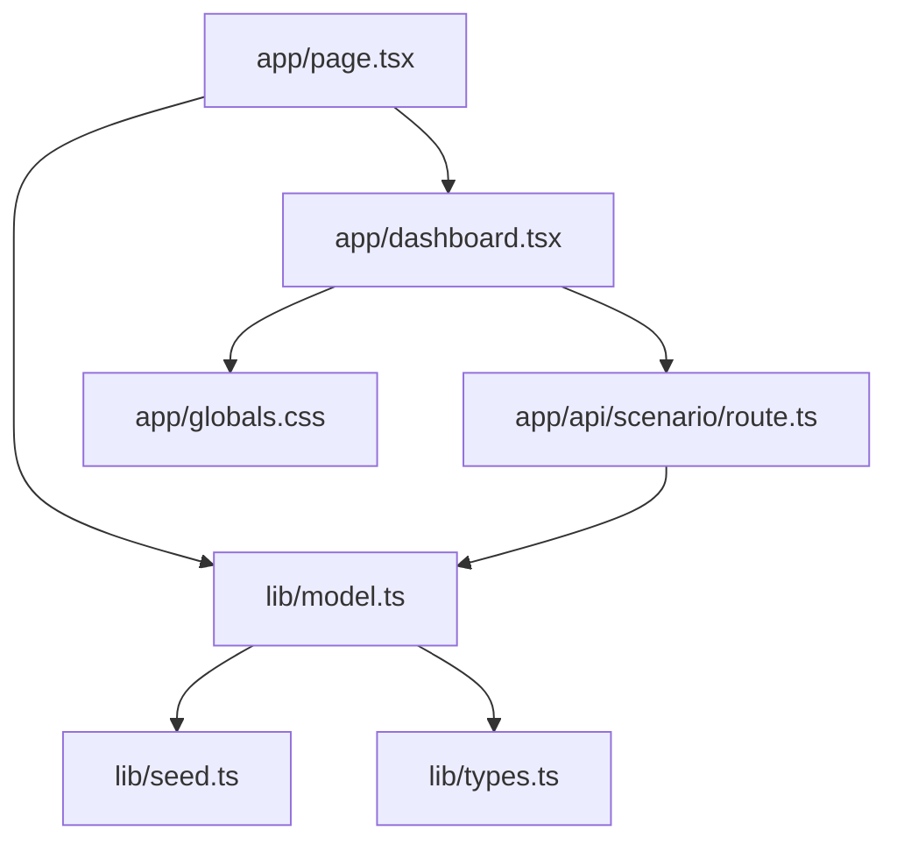

# Architecture

## Goals

Weekmark demonstrates a portfolio-grade household-finance product without importing or imitating a private financial application. The architecture prioritizes deterministic behavior, inspectable formulas, small trust boundaries, responsive interaction, and a clear separation between evidence and assumptions.

## Runtime shape

- `lib/seed.ts` creates the complete fictional ledger from one constant seed.
- `lib/model.ts` contains normalization, amortization, runway, exception, waterfall, and quote-gate calculations. It is pure and has no I/O.
- `app/page.tsx` produces the initial server-rendered bundle.
- `app/api/scenario/route.ts` accepts a small JSON scenario object, rejects invalid media types and oversized bodies before parsing, bounds every field, recalculates through the shared model, and returns a no-store response.
- `app/dashboard.tsx` owns transient interaction state only.
- `app/globals.css` provides the visual system, responsive rules, focus treatment, reduced-motion behavior, and print layout.

## Why a server route when data is synthetic?

The scenario endpoint demonstrates a realistic full-stack seam:

- the browser never owns the canonical calculation;
- server and initial-render calculations share one model;
- inputs are bounded at the trust boundary;
- model code remains unit-testable without a browser;
- a future source adapter could replace the seed without rewriting the interface.

The route is intentionally stateless. No database or browser persistence is required for the portfolio goal.

## State model

There are three state classes:

1. **Seeded evidence** — deterministic ledger, obligations, one-off events, and trends.
2. **Scenario assumptions** — income, reserve rate, spending cap, cost adjustment, cash floor, and financing terms.
3. **Derived outputs** — runway, safe-to-spend cap, waterfall, exceptions, and quality checks.

Client-only state is limited to selections, filters, acknowledgement toggles, drafts, loading, and error feedback. Acknowledgements intentionally reset on reload.

## Failure behavior

- Invalid JSON receives HTTP 400.
- Arrays and other non-object payloads receive HTTP 400.
- Bodies over 4 KB receive HTTP 413 before JSON parsing.
- Requests without an `application/json` media type receive HTTP 415 before the body is read.
- Numeric inputs are finite-checked and clamped to documented ranges.
- Invalid enums and terms fall back to safe defaults.
- API failures retain the last successful dashboard and display an inline alert.
- All scenario responses use `Cache-Control: no-store`.

## Clean-room constraints

- The project lives in its own new folder and has no private-repository ancestry.
- The data vocabulary is generic and the brand is unique to the demo.
- No private source tree is imported or referenced.
- No production connector, credential, deployment, or remote repository is configured.
