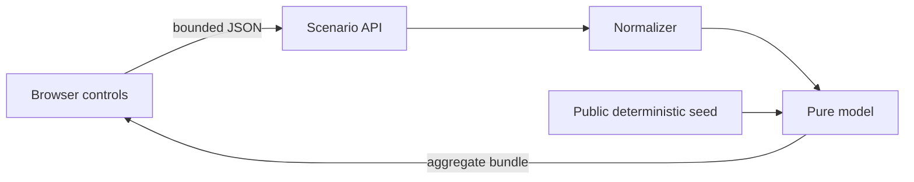

# Privacy threat model

## Scope

Weekmark is a public-demo application with fictional deterministic data. The primary privacy objective is to prevent accidental reuse, inference, or persistence of real household financial information while still demonstrating realistic product engineering.

## Assets to protect

- real household identities and relationships;
- real balances, income, liabilities, transactions, schedules, and tax figures;
- account, routing, statement, and credential data;
- private repository history and source-specific naming;
- any future user-entered financial values beyond the current browser session.

## Trust boundaries

The API boundary accepts only the documented scenario fields. The seed and model perform no external reads.

## Threats and mitigations

| Threat | Impact | Mitigation |
| --- | --- | --- |
| Copying private data into the public demo | Disclosure of personal financial information | Clean-room folder, unique schema and brand, fictional seed, restricted-identifier tests |
| Secret or token committed later | Connector or account compromise | No connector code or environment keys; CI/source scans can be extended before any integration |
| Sensitive browser persistence | Values remain on a shared device | No localStorage, cookies, database, or analytics; acknowledgements are memory-only |
| Input abuse | Runtime errors, resource exhaustion, or extreme calculations | JSON media-type gate, 4 KB streamed-body ceiling, non-array object check, finite-number check, enum validation, and field clamping |
| Cached scenario responses | Assumptions exposed through intermediaries | API returns `Cache-Control: no-store` |
| False confidence in model output | Harmful financial decision | Fictional-data banner, provenance labels, confidence states, formula docs, and advice disclaimers |
| Re-identification through labels | Generic demo linked to a real household | Generic household, account, obligation, employer-free, and institution-free vocabulary |
| Private git ancestry | Deleted private files recoverable from public history | New folder and independent repository initialization only; no copy of private `.git` or commits |

## Deliberately absent data

The schema has no merchant, payee, memo, raw transaction, institution, employer, address, account number, routing number, access token, credential, tax return, statement, or receipt field.

## Future integration requirements

A future live-data adapter would materially change this threat model. Before adding one:

1. create a separate private deployment and repository policy;
2. perform secrets and history scans;
3. use server-side read-only credentials with least privilege;
4. minimize and aggregate before persistence;
5. add authentication, authorization, retention, deletion, and audit controls;
6. complete a new security and privacy review;
7. never merge a live-data branch into the public demo without stripping history.

## Residual risk

Users can manually type values resembling their finances into scenario controls. The current app does not persist or transmit those values beyond the local server request, but screenshots, browser extensions, operating-system telemetry, and development tooling remain outside this application’s control.
